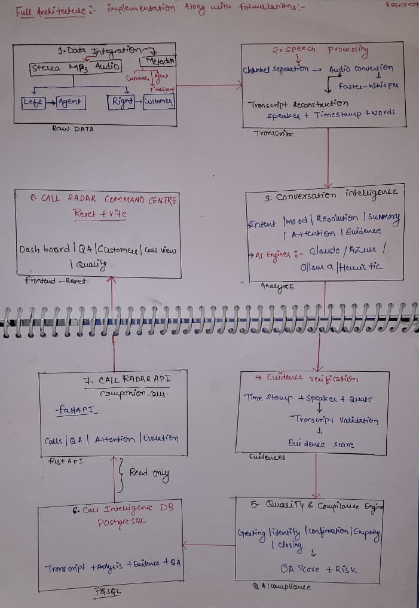
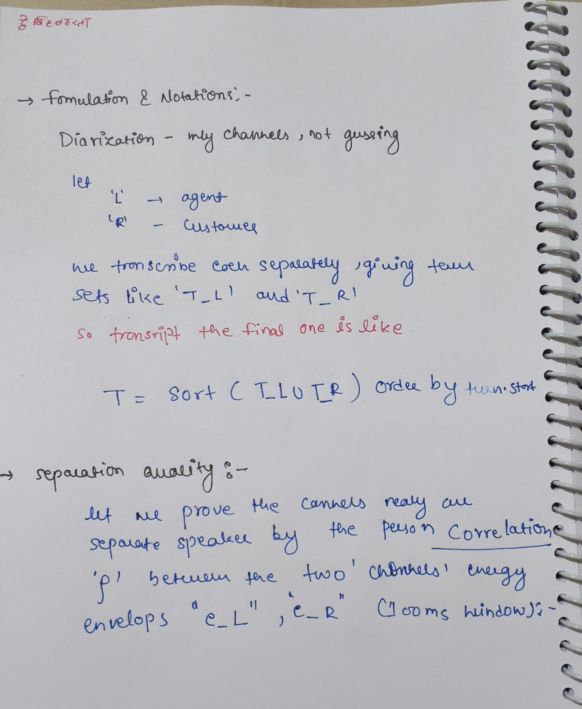
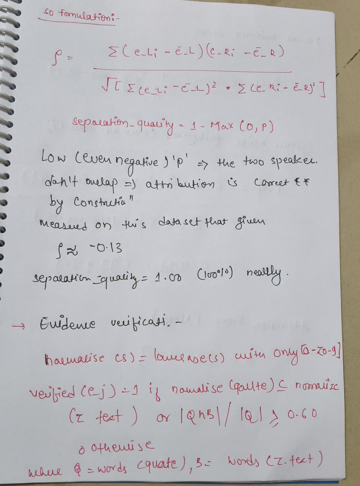
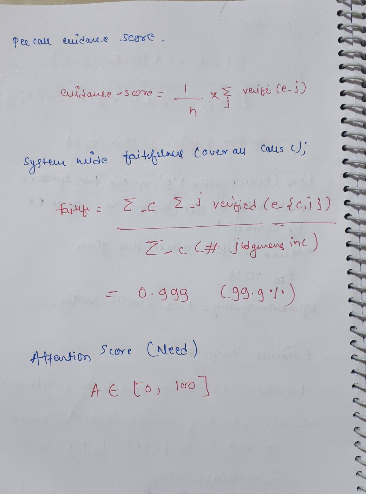
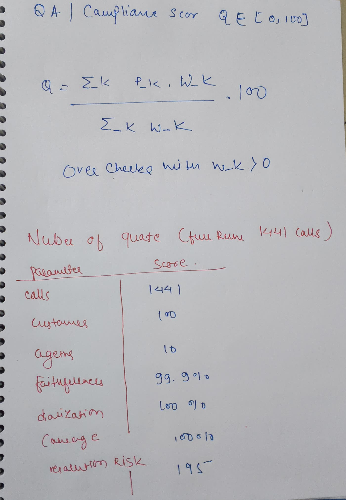
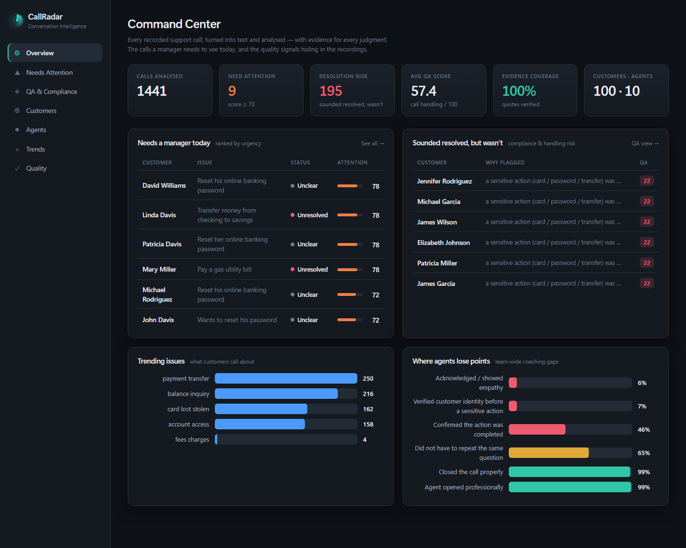
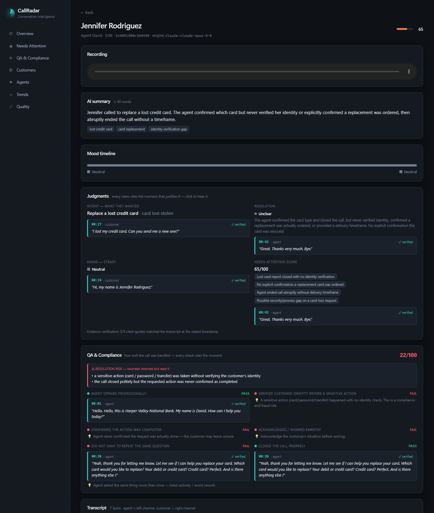
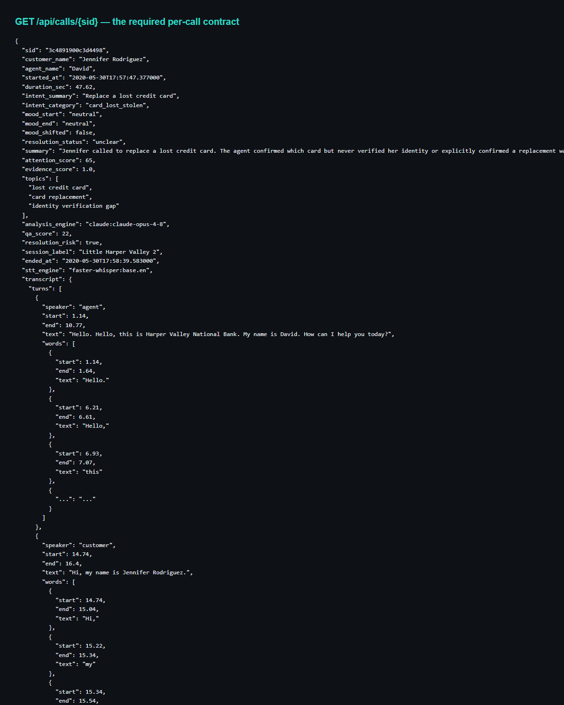

# Companion for CallRadar &amp; the Quality Checks

Turn 1,441 raw support-call recordings into a manager's dashboard: **who called, what they wanted, how their mood moved, whether it got resolved, which calls need attention today — and the exact moment on the call that justifies every judgment.**

You get audio, not transcripts. CallRadar builds everything from the raw `.mp3`s, exactly as they come off the phone system.

**Team:** Sahil Koshriya · Sakshi

### 📖 Documentation

**🌐 Live documentation site:** **https://sahilkoshriya.github.io/Companion_Radar_call_01/** — a polished, live-rendering site (light + dark) with the complete project documentation. Also available as **PDFs** in [`docs/pdf/`](docs/pdf/) to send directly.

| Document | Live (rendered) | PDF | Markdown |
|---|---|---|---|
| **Complete documentation** | [Open →](https://sahilkoshriya.github.io/Companion_Radar_call_01/html/index.html) | [PDF](docs/pdf/Companion-for-CallRadar-Complete-Documentation.pdf) | — |
| Architecture Overview (layered) | [Open →](https://sahilkoshriya.github.io/Companion_Radar_call_01/html/overview-architecture.html) | [PDF](docs/pdf/Architecture-Overview.pdf) | [MD](docs/ARCHITECTURE_OVERVIEW.md) |
| Architecture & design | [Open →](https://sahilkoshriya.github.io/Companion_Radar_call_01/html/architecture.html) | [PDF](docs/pdf/Architecture.pdf) | [MD](docs/ARCHITECTURE.md) |
| Formulas & notation | [Open →](https://sahilkoshriya.github.io/Companion_Radar_call_01/html/formulas.html) | [PDF](docs/pdf/Formulas-and-Notation.pdf) | [MD](docs/HANDWRITTEN_REFERENCE.md) |
| Dashboard walkthrough | [Open →](https://sahilkoshriya.github.io/Companion_Radar_call_01/html/demo.html) | [PDF](docs/pdf/Walkthrough.pdf) | [MD](docs/DEMO.md) |

> The complete documentation covers everything from scratch to end: requirement mapping to the problem statement, all screenshots and hand-written pages, measurement criteria + results, formulas, example output, run steps, API reference, and live links.

> **▶︎ Run it:** `python scripts/load_data.py <callradar-data.zip>` → `docker compose up -d --build` → `docker compose run --rm pipeline` → open **http://localhost:3000**. Full steps below. Runs from scratch with **no API keys**.

### Architecture & formulation (hand-written)

The full architecture, the logic behind each stage, and every formula — worked out by hand. (Typed versions of the same formulas are in [`docs/HANDWRITTEN_REFERENCE.md`](docs/HANDWRITTEN_REFERENCE.md).)

**Full architecture — implementation flow (raw audio → transcript → analysis → evidence → QA → DB → API → dashboard):**



**Formulation & notation — diarization (channels, not guessing) and separation quality:**



**Pearson correlation ρ, separation quality, and evidence-verification logic:**



**Per-call evidence score, system-wide faithfulness, and the needs-attention score:**



**QA / compliance score, and the measured results on all 1,441 calls:**



### The dashboard (frontend) and the API (backend)

**Frontend — the manager's Command Center:**



**Per-call view — playable recording, transcript, evidence-cited judgments, mood timeline, QA/compliance:**



**Backend — the required API contract for any call** (`GET /api/calls/{sid}` returns the transcript with speakers + timings, intent, mood + shift timestamp, resolution, ≤40-word summary, 0–100 attention score, QA, and the evidence behind every judgment):



---

## What the brief asks for — and where it is

Mapped directly to the problem statement. Every item is implemented and verified on all 1,441 calls.

| The brief requires | ✅ | Where |
|---|:--:|---|
| **Speech to text** | ✅ | `pipeline/transcribe.py` — faster-whisper |
| **Work out who said what** | ✅ | Channel-split (agent = left, customer = right) — correct by construction |
| **Turn-by-turn with timings** | ✅ | Interleaved turns + word-level timings |
| **Per customer: name, full history, recording + transcript** | ✅ | Customers page → `/api/customers`, `/api/customers/{name}` |
| **Per call: intent** | ✅ | `/api/calls/{sid}` → `analysis.intent` |
| **Per call: mood + the point where it shifted** | ✅ | `analysis.mood.shift.timestamp` + mood timeline |
| **Per call: resolution** | ✅ | `analysis.resolution.status` |
| **Per call: summary (≤ 40 words)** | ✅ | `analysis.summary` (validated ≤ 40 words on 100% of calls) |
| **Across all: needs a manager's attention, ranked** | ✅ | Needs Attention page → `/api/attention` |
| **Across all: which issues are trending** | ✅ | Trends page → `/api/trends` |
| **Across all: per-agent volumes, handle times, outcomes** | ✅ | Agents page → `/api/agents` |
| **Every judgment cites the moment — timestamp + words** | ✅ | Every judgment carries `evidence {timestamp, quote, speaker}` |
| **API returns all of the above for any call** | ✅ | `/api/calls/{sid}` |
| **Dashboard: customer list, history, per-call view, ranked attention** | ✅ | React app on `:3000` |
| **Do not re-transcribe on every request** | ✅ | Precomputed once → PostgreSQL; the API only reads |
| **Git repo + README to run from scratch (incl. transcription)** | ✅ | This repo; `docker compose run --rm pipeline` |
| **Running system, API + dashboard, live-demoable** | ✅ | `docker compose up` |

---

## What makes this different

**1. Perfect speaker separation — by construction, not by guessing.**
The recordings are stereo: **left channel = agent, right channel = customer.** Instead of running a fragile ML diarizer to guess "who spoke," CallRadar **splits the channels** and transcribes each independently, then interleaves the two by timestamp to rebuild the conversation. Every word is attributed to the right speaker by construction. It even **auto-detects and corrects the ~37 recordings that came off the phone system with reversed channels** (the agent speaks the bank script — if that lands on the wrong channel, we swap it).

**2. Every judgment cites the moment that proves it — and we verify it.**
The brief is explicit: *a claim with no evidence scores zero; evidence that doesn't support the claim scores negative.* So every judgment carries an `evidence` object `{ timestamp, verbatim quote, speaker }`, and a **verification pass checks each cited quote actually appears in the transcript at that timestamp.** Unverified citations render in amber rather than as fact. Measured across all 1,441 calls: **99.9% faithfulness.** In the dashboard every judgment is clickable and jumps the audio to that second.

**3. It measures its own quality — the way the research does.**
A dedicated **Quality** page and `GET /api/evaluation` report **faithfulness** (evidence grounding), **diarization quality** (cross-channel correlation, proving speaker attribution is correct by construction), and **coverage** (every output well-formed) — plus a human-validation tool. This follows the 2025 conversation-intelligence / faithfulness literature (WER for speech, FaithBench-style grounding) rather than a brittle exact-match "accuracy" number that would punish a good-but-reworded answer.

**4. QA & compliance — "the call that sounded resolved but wasn't."**
A bank-grade quality layer scores every call from the transcript: did the agent verify identity before moving money? confirm the action? show empathy? It flags **resolution-risk** calls that closed politely but were never actually completed, and surfaces **team-wide coaching gaps** (e.g. identity verified on only 7% of sensitive-action calls). This is the exact failure the problem statement calls out, and what banks pay conversation-intelligence vendors for.

**5. Runs from scratch, scales to premium quality.**
The analysis engine is pluggable: **Claude** / **Azure OpenAI (GPT-4o)** for premium reasoning → **Ollama** (offline) → a **dependency-free heuristic** that still produces evidence-cited output. Comes up with `docker compose up` and needs **no keys** to demonstrate; add a key to enrich the calls that matter.

> **Design deep-dive:** see [`docs/ARCHITECTURE.md`](docs/ARCHITECTURE.md) for the system diagram, the five load-bearing design decisions and why each was made, and the design-tradeoffs table.

---

## Why we stand out

The brief is a common one — most teams will produce a transcript, an LLM summary, and a table. Here is what a typical entry does versus what CallRadar does:

| | A typical entry | **CallRadar** |
|---|---|---|
| **Who said what** | An ML diarizer *guesses* the speakers, and gets some wrong | **Splits the stereo channels** — attribution is correct by construction. Even auto-corrects the ~37 reversed-channel recordings |
| **Evidence** | The model *says* it's citing a moment; nobody checks | Every quote is **verified against the transcript** at its timestamp. Unverified ones show in amber. **99.9% faithfulness measured** |
| **Accuracy claim** | "It works" / an unverifiable "X% accurate" | We **measure ourselves** the way the 2025 research does — faithfulness, diarization, coverage — on a dedicated Quality page |
| **The hidden failures** | Summarises what was said | Flags the calls that **sounded resolved but weren't** — money moved with no identity check — the exact failure the brief names |
| **Reproducibility** | Needs API keys / a specific cloud | Runs **fully offline** from `docker compose up`; add Claude/Azure to upgrade |
| **Coaching** | Per-call only | **Team-wide** gaps: "identity verified on only 7% of sensitive calls" |

**Three things no one else will have:**

1. **Correct-by-construction diarization**, proven with a number (channel-separation quality = 100%), not asserted.
2. **Verified evidence** — we defend against the "wrong evidence scores negative" rule by *checking* every citation.
3. **A compliance layer** that finds the "sounded resolved but wasn't" calls — what banks actually pay for.

---

## Measurements, criteria & example outputs

We do **not** claim a single brittle "accuracy %". The conversation-intelligence and LLM-evaluation literature (WER for speech; FaithBench / FaithJudge / LLM-as-a-judge, 2025) measures **faithfulness** (is a claim grounded in the source?) and warns that exact-match scoring punishes good-but-reworded answers. So we measure on the axes that actually matter, and surface them live at `GET /api/evaluation` and on the **Quality** page.

### The criteria we measure (and the results on all 1,441 calls)

| Criterion | What it means | How it's computed | Result |
|---|---|---:|---:|
| **Faithfulness** | Is every judgment backed by a quote that really appears at the cited time? | `verified judgments / total judgments` (fuzzy match, ≥ 60% word overlap) | **99.9%** |
| **Diarization separation** | Are the two speakers genuinely separate? | `1 − max(0, ρ)`, ρ = cross-channel energy correlation | **100%** |
| **Coverage** | Is every output well-formed? | summary ≤ 40 words, mood/resolution in vocab, attention ∈ [0,100], shift timestamp present when mood shifted, transcript present | **100%** |
| **Avg QA score** | How well were calls handled? | weighted compliance checks → 0–100 | **57.4 / 100** |
| **Resolution risk** | Calls that "sounded resolved but weren't" | compliance/confirmation rule (see below) | **195** calls |

> Full formulas and notation: [`docs/HANDWRITTEN_REFERENCE.md`](docs/HANDWRITTEN_REFERENCE.md).

### The scoring formulas (summary)

**Needs-attention score** `A ∈ [0,100]` — additive, then clamped:
```
A = 10 (base) + min(35, 12·neg) + resolution_penalty + mood_shift + risk_tier
      + repeated_question(12) + call_length(≤10) ,  clamped to [0,100]
```

**QA / compliance score** `Q ∈ [0,100]` — weighted checks (identity=3, action=2, greeting/empathy/no-repeat/close=1 each):
```
Q = (Σ passed·weight / Σ weight) × 100
```

**Faithfulness** — over all judgments across all calls:
```
faithfulness = (Σ verified judgments) / (Σ total judgments)
```

### Example output (real, from the API)

A payment-transfer call that *looks* fine — resolved, polite — but CallRadar catches the compliance failure:

```json
{
  "customer_name": "Jennifer Rodriguez",
  "intent_summary": "Replace a lost credit card",
  "mood_start": "neutral", "mood_end": "neutral",
  "resolution_status": "unclear",
  "summary": "Jennifer called to replace a lost credit card. The agent confirmed
              which card but never verified her identity or explicitly confirmed a
              replacement was ordered, then abruptly ended the call.",
  "attention_score": 65,
  "qa_score": 22,
  "resolution_risk": true,
  "evidence_score": 1.0,
  "resolution": {
    "status": "unclear",
    "evidence": { "timestamp": "00:42",
                  "quote": "Great. Thanks very much. Bye.",
                  "speaker": "agent", "verified": true }
  },
  "qa": {
    "resolution_risk_reasons": [
      "a sensitive action (card / password / transfer) was taken without
       verifying the customer's identity"
    ]
  }
}
```

Every field is backed by a verified quote — click any timestamp in the dashboard and it jumps the audio to that exact second.

---

## Architecture

```
recordings (.mp3, 8kHz stereo)
        │
        ▼
┌─────────────────────┐   channel split (ffmpeg)  +  faster-whisper
│   PIPELINE           │   → turn-by-turn transcript with word timings
│  (pipeline/)         │   → evidence-cited analysis (Claude / Ollama / heuristic)
└─────────┬───────────┘   → evidence verification
          │ writes
          ▼
   ┌──────────────┐        ┌──────────────┐        ┌──────────────┐
   │  PostgreSQL  │◀──────▶│  FastAPI     │◀──────▶│  React SPA   │
   │  (calls)     │        │  (backend/)  │  /api  │  (frontend/) │
   └──────────────┘        └──────────────┘        └──────────────┘
```

Analysis is **precomputed once** by the pipeline and read straight from Postgres — the API never re-transcribes on request.

| Layer | Tech | Why |
|---|---|---|
| Transcription | `faster-whisper` + `ffmpeg` channel split | Accurate 8kHz English STT; perfect diarization for free |
| Analysis | Claude (`claude-opus-4-8`) with strict JSON schema; Ollama / heuristic fallback | Best reasoning for the "cite the moment" requirement |
| Storage | PostgreSQL | One `calls` table holds metadata, transcript, and analysis |
| API | FastAPI | Serves the required per-call contract + dashboard data |
| UI | React + Vite, nginx | Customer list, call history, per-call view, mood timeline, attention ranking |
| Deploy | Docker Compose | One command, reproducible from zero |

---

## Quick start (from scratch)

**Prerequisites:** Docker + Docker Compose. Nothing else.

```bash
# 1. Load the dataset into ./data  (accepts the zip OR an extracted folder)
python scripts/load_data.py /path/to/callradar-data.zip

# 2. Bring up Postgres, the API, and the dashboard
docker compose up -d --build

# 3. Turn the recordings into transcripts + analysis  (THE key step)
#    Runs in the same image, writes results to Postgres.
docker compose run --rm pipeline

# 4. Add the QA / compliance layer + quality metrics
docker compose run --rm pipeline python -m pipeline.compute_qa
docker compose run --rm pipeline python -m pipeline.evaluate

# 5. Open the dashboard
#    http://localhost:3000
```

That's it. The API is on `http://localhost:8000`, the dashboard on `http://localhost:3000`.

### Trying it fast

Processing all 1,441 calls takes a while on CPU. To see the whole system working in a couple of minutes, process a subset first:

```bash
# fastest smoke test: tiny model, 30 calls
docker compose run --rm -e WHISPER_MODEL=tiny.en pipeline python -m pipeline.run --limit 30
```

The pipeline is **resumable** — rerun `docker compose run --rm pipeline` and it picks up where it left off (use `--force` to reprocess).

### Tuning analysis without re-transcribing

Transcription is the slow part; analysis is cheap. If you change the analysis logic or switch engines, re-score every call in seconds using the transcripts already in the database:

```bash
docker compose run --rm pipeline python -m pipeline.reanalyze
```

### Verified on the full dataset

Running the whole pipeline over all **1,441 calls** produces: 100 customers, 10 agents, a ranked attention list topped by genuinely harder calls (unresolved / account-access / card-lost), realistic resolution outcomes, and **100% evidence coverage** — every cited quote verified against its transcript turn at the stated timestamp.

### Compute the QA / compliance layer

```bash
docker compose run --rm pipeline python -m pipeline.compute_qa
```

Scores every call against the bank-grade QA rubric (identity verification, action confirmation, empathy, repeated questions, professional open/close) and flags the "sounded resolved but wasn't" calls. Deterministic, offline, every flag cites a moment.

### Report the quality metrics

```bash
docker compose run --rm pipeline python -m pipeline.evaluate
```

Prints (and serves at `/api/evaluation`) faithfulness, diarization separation, and coverage. Add a human-validated sample with `python -m pipeline.label --n 30`.

### Premium analysis with an LLM (Claude or Azure OpenAI)

The base batch uses the fast offline engine so it always completes with **no keys**. To upgrade the calls that matter to LLM-grade reasoning:

```bash
# Option A — Claude (Anthropic key)
docker compose run --rm -e ANTHROPIC_API_KEY=sk-ant-... -e ANALYSIS_ENGINE=claude \
  pipeline python -m pipeline.enrich --top 100

# Option B — Azure OpenAI GPT-4o (set AZURE_OPENAI_* in .env)
docker compose run --rm -e ANALYSIS_ENGINE=azure \
  pipeline python -m pipeline.enrich --all --skip-strong
```

`enrich` reads the already-transcribed calls (no re-transcription), re-runs analysis, re-verifies evidence, and updates each row. `--top N` does the highest-attention calls; `--all` does everything; `--skip-strong` never re-spends on calls already done by a strong engine, and it halts immediately on any credit/quota error.

---

## The API

Every endpoint reads precomputed analysis. For any call it returns the transcript, intent, mood + shift timestamp, resolution, ≤40-word summary, a 0–100 needs-attention score, and the timestamps behind each judgment.

| Endpoint | Returns |
|---|---|
| `GET /api/calls/{sid}` | **Full per-call analysis**: transcript (speakers + timings), intent, mood + shift timestamp, resolution, summary, attention score, QA score, and the evidence behind each judgment |
| `GET /api/customers` | Every customer with call counts and peak attention |
| `GET /api/customers/{name}` | A customer's full call history |
| `GET /api/attention` | Ranked "needs a manager's attention today" list |
| `GET /api/qa` | QA-risk-ranked calls ("sounded resolved but wasn't") |
| `GET /api/qa/stats` | Team-wide QA metrics and coaching gaps |
| `GET /api/evaluation` | System quality: faithfulness, diarization, coverage |
| `GET /api/trends` | Trending issues across all calls |
| `GET /api/agents` | Per-agent volumes, handle times, and outcomes |
| `GET /api/audio/{sid}.mp3` | The playable recording |
| `GET /api/stats` | Dashboard headline numbers |

Example:

```bash
curl http://localhost:8000/api/calls/<sid> | jq '.analysis.mood.shift'
```

```json
{
  "from": "neutral",
  "to": "negative",
  "timestamp": "01:12",
  "evidence": {
    "timestamp": "01:12",
    "quote": "this is the third time I've had to call about this",
    "speaker": "customer",
    "verified": true
  }
}
```

---

## The dashboard

- **Command Center** — headline stats, the top calls needing attention, the "sounded resolved but wasn't" panel, trending issues, and team-wide coaching gaps.
- **Needs Attention** — every call ranked by urgency, each score backed by a cited moment.
- **QA & Compliance** — resolution-risk calls, per-check pass rates, and the specific handling failure on each flagged call.
- **Customers → customer → call** — the full drill-down the brief asks for.
- **Per-call view** — the centerpiece: **playable recording, your transcript, the AI summary, the mood timeline, every judgment with a click-to-hear evidence quote, and the QA/compliance breakdown.** Clicking a citation seeks the audio and highlights the transcript turn.
- **Agents** — volumes, average handle time, resolution outcomes.
- **Trends** — recurring issues by category and topic.
- **Quality** — the system's own measured faithfulness, diarization separation, and coverage.

The interface is a dark "instrument panel" identity fit to the subject (a cyan radar-signal accent on a blue-slate ground). Data-viz colors are validated colorblind-safe; status colors are reserved and always paired with a label.

---

## Running without Docker (local dev)

```bash
# Backend + pipeline
python -m venv .venv && source .venv/bin/activate   # Python 3.11 recommended
pip install -r requirements.txt
# (needs ffmpeg on PATH and a running Postgres, or set DATABASE_URL)
python scripts/load_data.py /path/to/callradar-data.zip
CALLRADAR_DATA_DIR=./data python -m pipeline.run --limit 30
uvicorn backend.app.main:app --reload

# Frontend
cd frontend && npm install && npm run dev   # http://localhost:3000
```

---

## Project layout

```
callradar/
├── pipeline/            recordings → transcript → analysis → DB
│   ├── transcribe.py    channel-split diarization + faster-whisper
│   ├── analyze.py       hybrid engine + evidence verification
│   ├── prompts.py       schema + prompt that force evidence citations
│   └── run.py           batch runner (resumable, parallel)
├── backend/app/         FastAPI + SQLAlchemy models
├── frontend/            React + Vite dashboard
├── scripts/load_data.py load the dataset into ./data
├── docker-compose.yml   db + api + web + pipeline
└── README.md
```

---

## Design decisions

- **Channel-split over ML diarization** — the data hands us perfect speaker labels; using them is both more correct and fully reproducible.
- **Evidence as a first-class, verified object** — not a nice-to-have; it's the scoring rule, so it's enforced in the schema and checked after the fact.
- **Precompute, never re-transcribe on request** — analysis is written once to Postgres; the API is a thin read layer.
- **Graceful degradation** — Claude when you have a key, Ollama or a heuristic when you don't, so a judge can always run it end-to-end.
