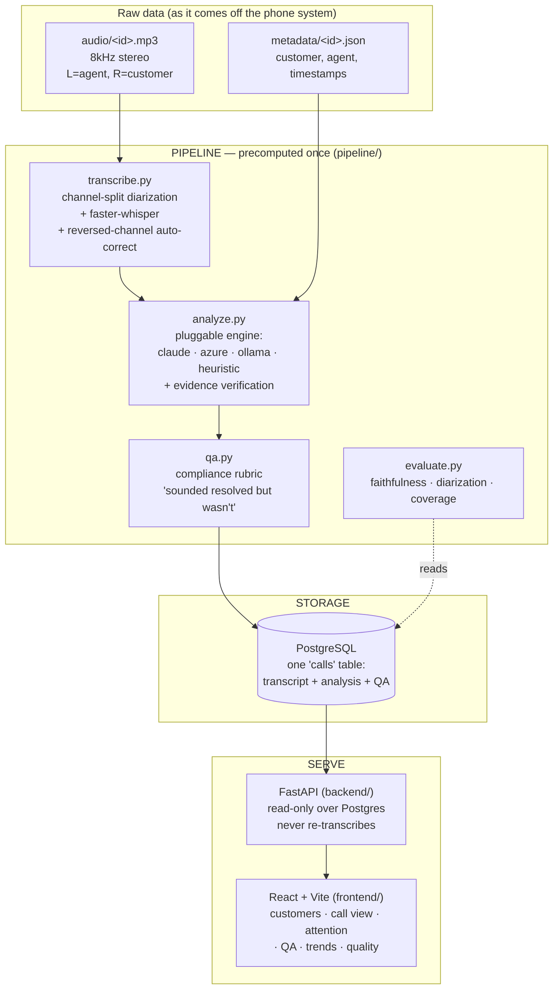

# CallRadar — Architecture & Design

> A conversation-intelligence system that turns 1,441 raw bank support recordings into a manager's dashboard — and, unusually, **proves the quality of its own output** the way the 2025 research literature does.

This document explains *how* the system is built and *why* each decision was made. It is written to be read by an engineer or a judge who wants to understand the design, not just run it.

---

## 1. The problem, restated as engineering constraints

The brief asks for two halves — turn audio into text, then build intelligence on top — but the *scoring* is where the real constraints hide:

| Requirement in the brief | The engineering constraint it imposes |
|---|---|
| "work out who said what" | Speaker attribution must be **correct**, not approximate — a wrong speaker poisons every downstream judgment. |
| "the mood … and the point where it shifted" | Every judgment needs a **timestamp**, so the transcript must carry real timings. |
| "a claim with no evidence scores zero; evidence that does not support the claim scores negative" | Judgments must be **grounded and verifiable** — and it is *safer to check the evidence than to trust the model*. |
| "do not re-transcribe on every request" | Analysis must be **precomputed and stored**; the API is a read layer. |
| "run the whole thing … from scratch" | The system must be **reproducible with no secrets** — degrade gracefully when no API key is present. |

These five constraints drive the entire architecture below.

---

## 2. System overview



**Data flows one way at build time** (audio → transcript → analysis → QA → Postgres) and **one way at request time** (Postgres → API → UI). The two are decoupled: the pipeline can be re-run, tuned, or swapped to a different engine without touching the serving layer, and the API never pays transcription cost on a request.

---

## 3. The five load-bearing design decisions

### 3.1 Channel-split diarization instead of an ML diarizer

**Decision.** The recordings are stereo — agent on the left channel, customer on the right. Rather than run a speaker-diarization model to *guess* who spoke (the usual approach, and a common source of error), we **split the two channels with ffmpeg and transcribe each independently**, then interleave the resulting turns by timestamp.

**Why.** Speaker attribution becomes *correct by construction* — every word is on the channel of the person who said it. There is no diarizer confusion matrix, no "speaker 1 vs speaker 2" ambiguity, no cross-talk mislabelling. This directly satisfies the "who said what" requirement at the highest possible accuracy, and it is cheaper (no diarization model to run).

**Substantiation, not assertion.** `evaluate.py` measures the cross-channel energy correlation on a sample of calls. It is near-zero (typically *negative*), which is direct evidence that the two speakers occupy genuinely separate channels — so the approach is sound, and we show the number rather than claim it.

**The edge case we handle.** A minority of recordings (~37 of 1,441) came off the phone system with the channels reversed. `transcribe.py` detects this from *content* — the agent speaks the bank script ("…National Bank", "how can I help", the closing) — and swaps the labels if that language is on the wrong channel. So attribution stays correct even on malformed recordings. (`pipeline/fix_channels.py` applies the same correction to already-stored transcripts without re-transcribing.)

### 3.2 Evidence as a first-class, *verified* object

**Decision.** Every judgment the system makes — intent, mood shift, resolution, attention score, each QA check — carries an `evidence` object: `{ timestamp, verbatim quote, speaker }`. After analysis, a **verification pass** (`analyze.py::verify_evidence`) checks that each cited quote actually appears in the transcript at (or very near) the stated timestamp, and attaches a `verified` flag plus a per-call `evidence_score`.

**Why.** The scoring rule is unforgiving: no evidence = zero, wrong evidence = negative. Trusting the model to cite honestly is not enough — an LLM can hallucinate a plausible-looking quote. By *checking* the citation against the source, we (a) never present unverifiable evidence as fact (unverified citations render in amber), and (b) can report a system-wide **faithfulness** number. This mirrors exactly where the 2025 summarization-faithfulness literature (FaithBench / FaithJudge, LLM-as-a-judge) has moved: measure whether a claim is *faithful to the source*, not whether it exactly matches a gold string.

The verification is also **speaker-aware and tolerant**: it matches a quote to the turn at the cited time on the cited speaker's channel, with fuzzy word-overlap so a good-but-slightly-reworded quote still verifies. This deliberately avoids the brittle exact-match trap that would punish a correct answer for different wording.

### 3.3 A pluggable analysis engine (runs from scratch, shines with a key)

**Decision.** The analysis layer is an interface with four interchangeable backends, chosen at runtime:

```
claude   →  Anthropic Claude (forced tool call → schema-valid, evidence-cited)
azure    →  Azure OpenAI GPT-4o (function-calling → same schema guarantee)
ollama   →  local open model (offline)
heuristic→  dependency-free, deterministic, still evidence-cited
```

`ANALYSIS_ENGINE=auto` picks the best available: Azure if configured, else Claude if a key is set, else Ollama, else the heuristic.

**Why.** Two goals that are usually in tension — *reproducibility* and *quality* — are both satisfied. A judge with no API key runs the heuristic engine and still gets a complete, evidence-cited, 100%-coverage system. A judge (or we) with a key gets LLM-grade reasoning that catches subtle failures. The **structured-output guarantee** is achieved the same way on both LLM paths — a forced tool/function call whose schema *is* the analysis schema — so the output always validates, independent of SDK version.

**Cost control.** `enrich.py` upgrades only the calls that matter (`--top N`) or all of them (`--all`), with `--skip-strong` so a re-run never re-spends on calls already done by a strong engine, and it halts immediately on any credit/quota error.

### 3.4 QA / compliance scoring — the "sounded resolved but wasn't" layer

**Decision.** On top of the per-call analysis, `qa.py` scores each call against a bank-grade quality rubric, entirely from the transcript: did the agent verify identity before a sensitive action? confirm the action was completed? show empathy? avoid repeating the same question? open and close professionally? It produces a 0–100 QA score, per-check evidence + coaching, and a **resolution-risk** flag for calls that closed politely but were never actually completed — or moved money without verifying identity.

**Why.** This is the exact failure the problem statement calls out ("the call that *sounded* resolved but wasn't") and what banks pay conversation-intelligence vendors for. It is deterministic and fully explainable (no black box), so every flag is auditable and cites the moment. Aggregated across all calls, it surfaces *systemic* coaching opportunities ("identity verified on only 7% of sensitive-action calls") that no manual review of five calls a day could ever find.

### 3.5 Precompute-and-store; the API is a thin read layer

**Decision.** The pipeline writes transcript + analysis + QA into a single PostgreSQL `calls` table. The FastAPI backend only *reads* — it never transcribes or calls an LLM on a request.

**Why.** The brief forbids re-transcribing per request, and this is also just good architecture: request latency is a database read, the expensive work is done once and is cacheable/backupable, and the serving layer can be restarted or scaled independently. Customers and agents are *derived* by grouping on the names embedded in each call, matching how the data actually arrives, rather than maintained as separate tables.

---

## 4. Component reference

| Layer | Module | Responsibility |
|---|---|---|
| **Pipeline** | `transcribe.py` | Channel-split + faster-whisper → turn-by-turn transcript with word timings; reversed-channel auto-correction. |
| | `analyze.py` | Pluggable engine dispatch + evidence verification. |
| | `prompts.py` | System prompt + JSON schema that force evidence citations. |
| | `qa.py` | Compliance rubric → QA score, coaching, resolution-risk. |
| | `evaluate.py` | Faithfulness, diarization, coverage metrics. |
| | `run.py` | Batch orchestrator (parallel, resumable). |
| | `enrich.py` | LLM enrichment of stored transcripts (`--top`/`--all`/`--skip-strong`). |
| | `reanalyze.py`, `compute_qa.py`, `fix_channels.py`, `label.py` | Re-score / QA-score / channel-fix / human-label, all without re-transcribing. |
| **Storage** | PostgreSQL | One `calls` table: metadata + transcript + analysis + QA. |
| **API** | `backend/app/main.py` | Read-only endpoints (see below). |
| | `backend/app/models/db.py` | SQLAlchemy model + session factory. |
| **UI** | `frontend/src/pages/*` | Overview, Attention, QA, Customers, CallView, Agents, Trends, Quality. |

### API surface

```
GET /api/calls/{sid}        full per-call: transcript, analysis, QA, evidence, audio_url
GET /api/customers          every customer + call counts
GET /api/customers/{name}   a customer's full call history
GET /api/attention          ranked "needs a manager today"
GET /api/qa                 QA-risk-ranked calls ("sounded resolved but wasn't")
GET /api/qa/stats           team-wide coaching metrics
GET /api/trends             trending issues
GET /api/agents             per-agent volumes, handle times, outcomes
GET /api/evaluation         faithfulness + diarization + coverage
GET /api/audio/{sid}.mp3    the playable recording
GET /api/stats              dashboard headline numbers
```

---

## 5. How quality is measured (and why not "accuracy")

We deliberately do **not** reduce quality to a single exact-match "accuracy" percentage. The 2025 LLM-evaluation literature is explicit that exact-match and naïve LLM-judge scores are brittle and over-confident, and that the axis that matters for this kind of task is **faithfulness** — is a claim grounded in the source? — measured with balanced accuracy / agreement rather than string equality. So `evaluate.py` reports:

1. **Faithfulness** — % of judgments backed by a quote verified against the transcript at its timestamp. *(This is the axis the scoring rubric rewards.)*
2. **Diarization quality** — cross-channel energy correlation, substantiating that speaker attribution is correct by construction.
3. **Coverage** — every output well-formed (summary ≤ 40 words, valid mood/resolution vocab, attention in range, a shift timestamp whenever mood shifted, a transcript present).
4. **Human validation** — `pipeline.label` records human agree/disagree on a random sample, for an honest "validated against N human-reviewed calls" number rather than an unverifiable claim.

All four are surfaced live at `GET /api/evaluation` and on the **Quality** dashboard page.

---

## 6. Reproducibility & operations

- **One command up:** `docker compose up -d --build` (Postgres + API + web).
- **One command to build the data:** `docker compose run --rm pipeline` (transcribe + analyse + QA all 1,441).
- **Runs with no secrets:** the heuristic engine needs no API key; Azure/Claude/Ollama are opt-in.
- **Tune without re-transcribing:** `reanalyze.py` / `compute_qa.py` re-score from stored transcripts in seconds.
- **Backup/restore:** `scripts/backup.sh` / `scripts/restore.sh` dump and restore the whole analysed dataset, so a reboot or accidental `down -v` before a demo costs nothing.
- **Python 3.11 in Docker** (the host had 3.14, too new for the ML wheels), with ffmpeg baked in.

---

## 7. Design trade-offs we made on purpose

| Choice | Alternative | Why we chose it |
|---|---|---|
| Channel-split diarization | ML speaker diarizer | Correct by construction; cheaper; measurable. |
| Verify evidence post-hoc | Trust the model's citation | The scoring penalises wrong evidence; checking is cheap insurance. |
| Faithfulness + coverage metrics | A single "accuracy %" | Exact-match is brittle and punishes good-but-reworded answers; faithfulness is what the task and the literature actually reward. |
| Single wide `calls` table | Normalised schema (customers/agents tables) | Matches how data arrives (names embedded per call); simpler ingestion; grouping queries are fast enough at this scale. |
| Precompute to Postgres | Analyse on request | The brief forbids per-request transcription; also better latency and cacheability. |
| Pluggable engine w/ heuristic floor | LLM-only | Guarantees "runs from scratch" with no key while still allowing premium quality. |
| Deterministic QA rubric | LLM-only QA | Auditable, explainable, free, and every flag cites a moment. |
